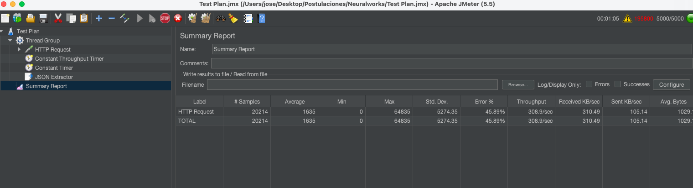

# Respuestas Challenge técnico José Baboun
Hola equipo de Neuralworks!

En esta carpeta encontraran mis respuestas para el challenge técnico. Si bien fue trabajoso, estuvo bien entretenido y aprendí algunas cosas en el proceso también, por lo que terminé contento :) 

## Organización de los archivos

La carpeta contiene todos los archivos que usé en el proceso. Describo en términos generales los archivos a continuación:

- Los notebooks exploración_datos y modelos que cubren los 3 primeros puntos del challenge. Estos están documentados. Las principales conclusiones y decisiones se encuentran dentro de los archivos.
- sinthtic_features.csv es el archivo generado con las nuevas columnas.
- best_model.sav es el mejor modelo serializado obtenido en el notebook de modelos.
- app.py es el archivo que implementa la api. Por su parte, api_test.ipynb testea su funcionamiento.
- Dockerfile y cloudbuild son los archivos utilizados para Docker en Google Cloud.
- requirementes.txt es el archivo obtenido a través de ``` pip3 freeze > requirements.txt ```. 
- Summary Report.jmx es el archivo generado por Jmeter tras las pruebas de estrés.

## Respuestas

Las respuestas de las preguntas de los puntos 1,2, 3 y 4 están documentadas en los respectivos notebooks. 

5. Utilizamos flask para serializar la API. Se elige por se un framework que se acopla perfectamente el desarrollo de los modelos en Python de la sección anterior, su flexibilidad, simpleza y escalabilidad.
6. Se elige Google Cloud ya que proporciona una plataforma robusta y escalable para el despliegue de aplicaciones. Es una plataforma, rápida y confiable al rededor del mundo. Además, en caso de necesitarlo, nos permite escalar nuestros requerimientos de manera natuaral. También cuenta con una serie de funciones para complementar su funcionalidad.
    
    En segundo lugar, Docker es una tecnología ampliamente adoptada para el empaquetado y despliegue de aplicaciones en contenedores. Permite encapsular una aplicación y sus dependencias de manera simple. Esto facilita la implementación en diferentes entornos sin preocuparse por las diferencias de configuración. Docker nos garantiza un entorno aislado y consistente para ejecutar aplicaciones.
    
    Combinar Google Cloud y Docker nos da una muy buena sinergia. Se garantiza que la aplicación se ejecute de manera consistente y predecible en el entorno de Google Cloud, independientemente de las diferencias entre los sistemas operativos y configuraciones locales. A partir de esta combinación obtenemos escalabilidad, confiabilidad, portabilidad y facilidad de gestión para administrar la API de manera eficiente.

7. En la siguiente tabla se encuentran los resultados de la prueba de estrés. 

    Queda al descubierto que la api no fue capaz de responder al estrés causado por la prueba. Se proponen las siguientes estrategias para mejorar el rendimiento:
    
    1. Aumentar el número de instancias de contenedores en Docker. Para esto se puede usar Google Kubernetes Engine (GKE), que gestiona y escala automáticamente los contenedores en un clúster de Kubernetes. Así podemos distribuir de mejor forma la carga. 
    2. Mejorar la infraestuctura. Aumentar recursos de CPU y memoria dentro de Google Cloud. 
    3. Optimizar la implementación del contenedor. Revisar si las imágenes son lo suficientemente eficientes.
    4. Usar servicios como Cloud Load Balancing y Cloud Auto Scaling para escalar automáticamente las instancias de acuerdo al tráfico. 

